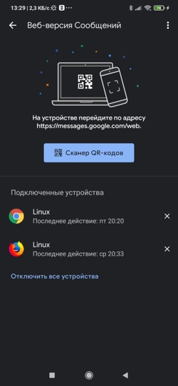

# Автоматическое получение балансов и запись в PostgreSQL
## DDL
```
CREATE TABLE balance.balance (
	balance float8 NULL,
	id int8 NULL,
	date_load timestamp(0) NULL
);

CREATE TABLE balance.alfa_bank (
	"date" timestamp NULL,
	"type" text NULL,
	category text NULL,
	sum float8 NULL,
	currency text NULL,
	account text NULL,
	description text NULL,
	"comment" varchar NULL,
	date_load timestamp(0) NULL
);
```

## Тестирование результата 
Получение организовано как [dag Airflow](https://airflow.apache.org/). Dag состоит из 2 классов:<br> 
1. TelecomScraper - получение баланосв по опреаторам телеком.<br>  
1. AlfaScraper - получение данных с банка Алфа-банк.<br>  

Примеры [jupyter notebook](https://jupyter.org/) получения балансов: 
* для операторов [MTS](https://mts.ru), [Megafon](https://megafon.ru) и [Alliance](https://alliance.anynet.su/) можно увидеть [тут](./notebook/telecom.ipynb).  
* для получения выписки и баланса [Альфа-Банк](https://alfabank.ru/) можно увидеть [тут](./notebook/alfa.ipynb). 

## Настройка смартфона (android)
Входим через [selenium](https://ru.wikipedia.org/wiki/Selenium) на страницу https://messages.google.com/web и сканируем [qrcode](https://ru.wikipedia.org/wiki/QR-%D0%BA%D0%BE%D0%B4) для входа:<br>
<br>

## Настройка получения данных с Альфа-Банка
```
# Заходим внутрь docker Airflow
docker exec -it <id_docker>  bash                               
# заходим в необходимый dag
cd dags/balance/
# Вызываем python
python 

# Для работы с ОС
import os

# Импортируем модуль получения данных
from src.AlfaScraper import AlfaScraper

# Для работы с SQL
from sqlalchemy import create_engine
# Для работы с Postgre
import psycopg2

# Получаем переменные окружения
PG_HOST = os.environ['PG_HOST']
PG_PASSWORD = os.environ['PG_PASSWORD']
LOGIN_NAME = os.environ['LOGIN_NAME']
ALFA_USER = os.environ['ALFA_USER'] 
ALFA_PASSWORD = os.environ['ALFA_PASSWORD'] 

# Создаем подключение к pg
engine = create_engine(f'postgres://{LOGIN_NAME}:{PG_PASSWORD}@{PG_HOST}:5432/{LOGIN_NAME}')
conn = psycopg2.connect(f"host='{PG_HOST}' dbname='{LOGIN_NAME}' user='{LOGIN_NAME}' password='{PG_PASSWORD}'")

# Создаем объект класса            
alfa_scraper = AlfaScraper( 
    alfa_login = ALFA_USER
    ,alfa_password = ALFA_PASSWORD
    ,engine = engine
    ,conn = conn
    ,host = PG_HOST
)

# Првоеряем доступность sms 
alfa_scraper.driver.get('https://messages.google.com/web/conversations/4')
# При необходимости сканируем qr-code
alfa_scraper.driver.save_screenshot('/share/screenshot.png')
# Запоминаем ПК в профиле пользователя chrome
alfa_scraper.check_use_pc()

# В функции accounts расскомментируем строку
self.driver.find_element_by_css_selector('#login-input').send_keys(f"{self.alfa_login}")
# После выполнения опять необходимо закомментировать, так как в профиле логин будет заполняться автоматически и необходимо будет заполнить только пароль

# Закрываем браузер
alfa_scraper.close_all()
```
## Отображение результат
Результат отображается через [conky](https://github.com/VolokzhaninVadim/conky).


